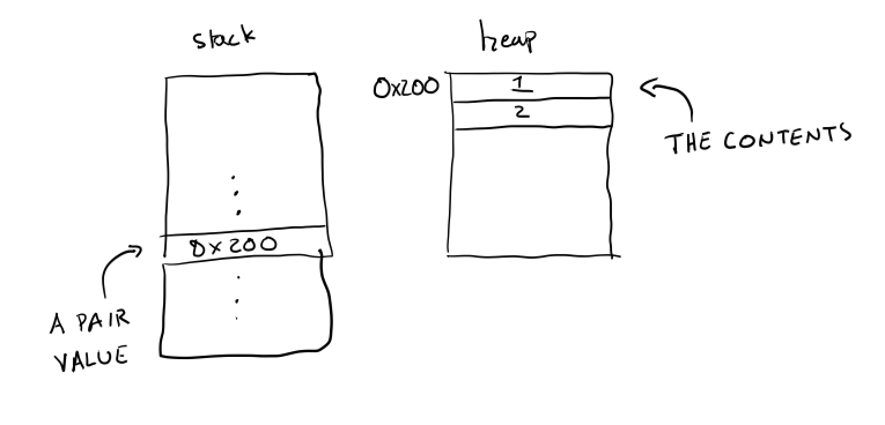
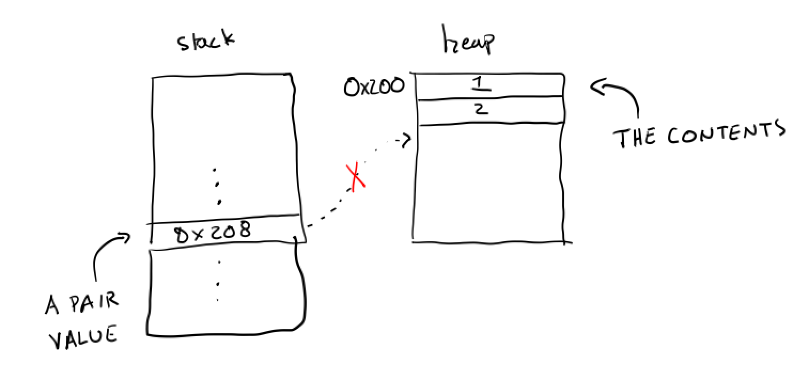

_Code for these notes is at [https://github.com/ucsd-cse131-s18/ucsd-cse131-s18.github.io/lectures/05-07-mon/](https://github.com/ucsd-cse131-s18/ucsd-cse131-s18.github.io/lectures/05-07-mon/)_

# Heap Allocation

So far, we've seen a number of different, interesting uses of memory for
storing variables, intermediate values, and stack frames for function calls.
These have all used what we'd traditionally call _stack space_ – an area of
memory that grows and shrinks to hold values that will be used by the
computation-in-progress. In addition, our values have been numbers and
booleans, which we'd categorize in most languages as _primitive_ values.
This leads to a pair of limitations on the programs we've written so far:

- We haven't been able to create structured values that combine one or more
values into one logical entity
- We don't have any way to share references to the same data across contexts
or function – values are always copied (as single words), and stored for
temporary and relatively immediate use.

Both of these problems can be addressed by designating another area of memory
to act as what we'd traditionally call a _heap_. This is an area of memory
where we will store values that may persist across many function calls and
expressions, and store values that reference regions of memory holding
multiple other values. We'll need a few pieces to accomplish this:

- New expressions that allocate and manipulate heap data
- New representations for values that refer into heap space
- New runtime machinery to manage heap space

## A Model Feature for Heap Allocation

We will take _pairs_ as the simplest introduction to heap allocation. Their
concrete syntax will be the keyword `pair` followed by two expressions, which
evaluate to the “left” and “right” (or “first” and “second”) values of the
pair which will be stored on the heap. We'll also add `fst` and `snd` as new
operators that access the heap memory:

```
expr := ...
     | (pair <expr> <expr>)
     | (fst <expr>)
     | (snd <expr>)
```

The corresponding abstract syntax extension is a direct mapping in this case:

```ocaml
type expr = ...
     | EPair of expr * expr
     | EFst of expr * expr
     | ESnd of expr * expr
```

Pairs on their own are a powerful feature. We can use them to represent lists
and other data structures. We can consider generalizing them to _tuples_,
which could contain arbitrary elements, and we see in languages like Python
and OCaml.

To show the intended behavior, its useful to see some examples. For basic
mechanics:

```scheme
(let (x (pair 1 2)) (fst x)) ; evaluates to 1
(let (x (pair 1 2)) (snd x)) ; evaluates to 2

; evaluates to 2
(let (x (pair 1 2)) (let (y (pair x 0))
    (snd (fst y)))))
```

We might use pairs to represent _points_ or _coordinates_, as one simple use
case:

```scheme
(def (point x y) (pair x y))

; Adds the x and y coords of two points, creates a new one
(def (add p1 p2)
    (point (+ (fst p1) (fst p2)) (+ (snd p1) (snd p2))))

; Gets the grid-based distance (also called L1 or Manhattan distance)
(def (gridDistance p1 p2)
  (+ (abs (- (fst p1) (fst p2))) (abs (- (snd p1) (snd p2)))))
(def (abs n) (if (n < 0) (- 0 n) n)))

(def (our_main _)
  (let (p1 (point 1 3))
    (let (p2 (point 2 9))
      (let (origin (point 0 0))
        (gridDistance origin (add p1 p2)))))) ; evaluates to 15
```

(As an aside, note that we are getting to the point where our programs can at
least capture introductory programming assignments now.)

## Representing Pairs

Note that we can _return_ a reference to a pair from a function, store a
reference to a pair in a variable, or pass a pair as an argument to a
function. This means pair expressions evaluate to pair _values_, which we
must decide how to represent.

So far, all values have been represented within a single 4-byte word – this
seems difficult for pairs, which have _two_ values available. We could try a
two-word representation for pairs, and allow values to be represented by
multiple words. Indeed, this is what is done for stack-allocated structs in
languages like C. We will not take this route for a few reasons:

1. It doesn't generalize well to recursively-defined data – a pair that
contains another pair immediately confronts the question of if the nested
pair should appear _in place_ or _as a reference_. Storing it in place makes
it quite tricky to figure out the size of a pair (note that C does not allow
recursively-defined `struct`s!). If we store the nested pair as a reference,
we're back to representing references rather than multi-word values.
Recursively-defined data is critical for writing many interesting programs,
so we should tackle it head-on.
2. In terms of exploring the most interesting features into our growing
language, picking a uniformly-sized representation of values will let us
pursue memory management and optimization topics without introducing extra
complexity.

Instead, we will represent pair values as _references to data on the heap_.
We will set aside a special region of memory that exists for holding the
contents of pairs, put pairs' elements there, and use addresses into that
space to represent pair values, which are references to their contents.



## Representing the Heap

With this high-level goal in mind, we need to know what the structure of heap
storage is, and to create addresses into it. We will designate a new register
that we aren't currently using to be our _heap pointer_. We use a register
for this because we will expect to be allocating quite often and want quick
access to the address we'll use for allocation. A global variable at a
well-known address could be used for this as well. `EBX` isn't being used by
our compiler currently, so we can bring it into service as the heap pointer.

We need to somehow get a chunk of space that we can use for our heap. For
now, we'll duck the question of how to find a good region of memory by
deferring to the C standard library, and use `calloc`. That is, we'll set
aside a region of memory in `main.c` by simply asking the memory-management
library in C for the space, and pass a reference to the beginning of the
region to our compiled code:

```c
int main(int argc, char** argv) {
  int input = 0;

  int* MEMORY = calloc(10000, sizeof(int)); // Allocate 10000 words of heap space

  if(argc > 1) { input = atoi(argv[1]); }
  int result = our_code_starts_here(input, MEMORY);
  printf("%p %d\n", (int*)result, result);
  fflush(stdout);
  return 0;
}
```

We can then augment the prelude of `our_code_starts_here` to get that reference (which was passed as an argument, like `input`), and put it in `EBX` for our use:

```x86asm
our_code_starts_here:
  mov ebx, [esp+8]
  ... code for fetching input, calling our_main now assumes ebx points to start of free space ...
```

For now, we'll simply assume that the amount we use to initialize `MEMORY` is
enough for our programs. Clearly, this can't always be the case, but we'll
return to this issue later.

## Compiling Pairs

Now we can move on to compiling pairs, which will be responsible for
evaluating two sub-expressions, putting the resulting two values on the heap,
and putting the address of the start of those values into `EAX`. This is much
like the evaluation of an operator like `+`, which has two sub-expressions,
to start:

```ocaml
| EPair(f, s) ->
  let fis = e_to_is f si env in
  let sis = e_to_is s (si + 1) env in
  fis @ [sprintf "mov %s, eax" (stackval si)] @
  sis @ [sprintf "mov %s, eax" (stackval (si + 1))] @
  [
    ... to fill ...
  ]
```

After this comes the new behavior. We need to move the values onto the heap
somewhere. This needs to come with a crucial invariant that we will assume
and maintain: **the current address in `EBX` is the next free word for
allocation**. So we can put these two values into `EBX` and `EBX+4`:

```ocaml
    sprintf "mov eax, %s" (stackval si);
    sprintf "mov [ebx], eax";
    sprintf "mov eax, %s" (stackval (si + 1));
    sprintf "mov [ebx + 4], eax";
```

It's important to realize that if we just generated this assembly, we'd have
two remaining issues:

- Now, `EBX` is referring to the address where we put the first value of the
pair. Future allocations need to not write over that space! So, we need to
increase `EBX` so that it refers to the next empty space.
- We haven't specified what value this entire pair expression _evaluates to_.
That is, we need the code to **get the answer into `EAX`**.

It's important to do these two things in the right order! We need `EAX` to
refer to the address of the first item, and for `EBX` to be moved forward by
`8`. Which of the following two orders will accomplish this?

- ```ocaml
    "mov eax, ebx";
    "add ebx, 8";
  ```

- ```ocaml
    "add ebx, 8";
    "mov eax, ebx";
  ```

If we chose the second, we'd end up with our answer referring to the wrong
word in memory – the word _past_ the end of the pair:



We instead need to store the current address to `EAX` first, then add to the
heap pointer.

With this representation in mind, we can then directly use these addresses in
the compilation of expressions that access the first and second elements of
the pair. The `EFst` and `ESnd` instructions will rely on their expression
evaluating to an _address_, which they will then dereference appropriately:

```ocaml
| EFst(e) ->
  let tis = e_to_is e si env in
  tis @ [ "mov eax, [eax]" ]
| ESnd(e) ->
  let tis = e_to_is e si env in
  tis @ [ "mov eax, [eax + 4]" ]
```

This completes the basics of compiling pairs and pair access, relying on a
new _heap pointer_ in `EBX`, a new heap space allocated by `main.c`, and pair
values represented by addresses in heap space containing pair contents.

## Going Further

There are a few questions remaining for you to consider going forward:

- If we wanted to detect errors, like using `fst` on a number value, we'd
need to consider the difference in tags between pair values (references) and
number values.
- What should happen when we print pairs? If we make nested pairs, how does
this change the implementation of print?
- What happens when we check pairs for equality with one another? Should we
check if they are at the same address, or check their contents?
- What other kinds of heap-allocated values would be interesting to
implement? What other representation or expressions would we need, or would
be useful, in order to generalize to tuples of arbitrary length?
